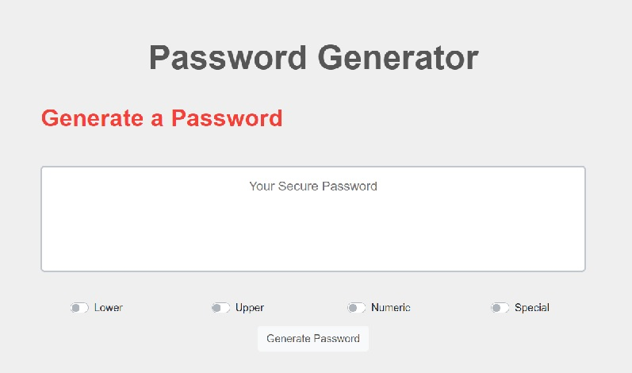

# js-password-generator

Is an application that generates a random password based on user-selected criteria. This app will run in the browser and features dynamically updated HTML and CSS powered by JavaScript code. A responsive and simple user interface has been implemented using bootstrap, ensuring that it will adapt to multiple screen sizes.
# Screenshot

;

# Goals

- Randomly generate a password that meets certain criteria (lowercase, uppercase, numeric, and/or special characters) as selected by user
- Create a strong password that provides greater security

# Deployed project
https://ldipaola.github.io/js-password-generator/

#Licence
[MIT](LICENSE)